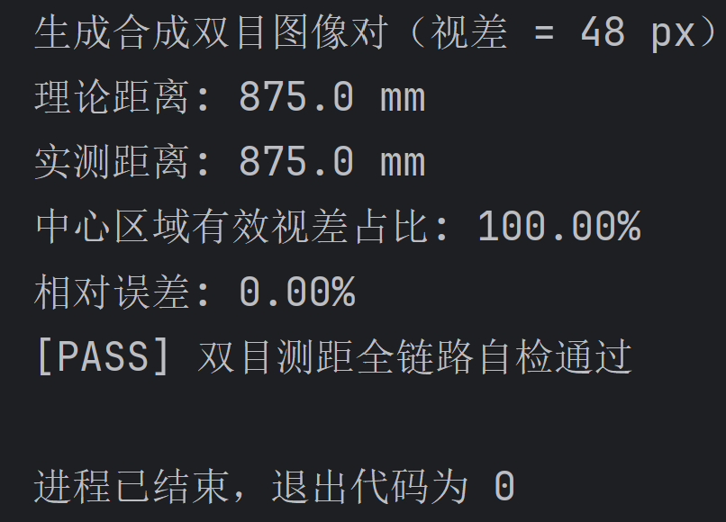

# 双目实时测距 (Stereo Vision Real-time Distance Measurement)

基于 OpenCV 的双目立体视觉实时测距项目。完整链路：

**双目标定 → 立体校正 → SGBM 立体匹配 → 视差 → 深度/距离输出**

支持双 USB 摄像头或双视频文件输入，实时显示左视图（中心/点击/人脸测距）与伪彩视差图。

## 原理

双目测距利用两台平行相机观察同一物体时产生的**视差**：

```
Z = f × B / d
```

- `Z`：物体到相机的距离（毫米）
- `f`：焦距（像素，来自标定结果 `P1[0,0]`）
- `B`：基线，即两相机光心之间的距离（毫米，来自标定结果 `T` 的模长）
- `d`：视差，即同一点在左右图像中的水平像素差（像素）

> 视差越大 → 距离越近；距离与视差成反比，因此近距离测量精度更高。

## 目录

```
stereo-distance-measurement/
├── stereo/                  # 核心包
│   ├── config.py            # 标定结果数据类（JSON 读写）
│   ├── calibration.py       # 棋盘格角点检测、单目/双目标定
│   ├── rectify.py           # 立体校正
│   ├── disparity.py         # SGBM 视差（可选 WLS）
│   ├── distance.py          # Z = f·B/d 深度换算、测距
│   ├── capture.py           # 双摄像头/双视频流读取
│   └── ui.py                # FPS、文字叠加、视差伪彩
├── scripts/
│   ├── calibrate.py         # 双目标定工具
│   ├── distance.py          # 实时测距主程序
│   └── self_test.py         # 合成数据自检
├── tests/                   # 单元测试
├── data/                    # 标定结果与采集图像（已 gitignore）
└── requirements.txt
```

## 安装

```bash
python -m venv .venv
# Windows
.venv\Scripts\activate
# Linux/macOS
source .venv/bin/activate

pip install -r requirements.txt
```

可选：启用 WLS 视差滤波（效果更好、速度略慢）

```bash
pip install opencv-contrib-python
```

## 快速开始（无标定近似模式）

```bash
python scripts/distance.py --cam-l 0 --cam-r 1 --focal 700 --baseline 60
```

- `--cam-l 0`、`--cam-r 1`：左右摄像头编号，请按实际设备调整
- `--focal 700`：焦距近似值（像素）。普通 720p 摄像头通常在 600~1200 之间，可用标定获得准确值
- `--baseline 60`：两相机光心间距近似值（毫米）

操作：左键点击任意点测距 | `F` 切换人脸测距 | `D` 显示/隐藏视差窗口 | `Q`/`ESC` 退出

## 标定（推荐，精度更高）

1. 打印一张**哑光**棋盘格（如 A4 纸，推荐 9×6 内角点，边长 24 mm），贴平。
2. 固定好两个摄像头（锁定焦距，**关闭自动对焦/自动曝光**），从不同距离和角度拍摄棋盘格。

实时采集并标定：

```bash
python scripts/calibrate.py --capture --cam-l 0 --cam-r 1 --pairs 15 --square 24
```

- 画面中棋盘格同时出现在左右两个画面时按 **空格** 保存当前对，**ESC** 完成并开始标定
- 每对图像需包含完整棋盘格，尽量变换位置、倾斜角度（15°~30°）
- 结果默认保存到 `data/calibration.json`

离线标定（已有图像对，文件名需同名）：

```bash
python scripts/calibrate.py \
  --left-dir data/captures/left \
  --right-dir data/captures/right \
  --square 24
```

输出示例：

```
成功使用 15 对图像
单目重投影误差 L=0.1543 px, R=0.1621 px
双目重投影误差 0.2315 px
焦距 f = 714.32 px
基线 B = 59.82 mm
```

> 重投影误差 < 1 px 说明标定质量良好。

## 标定后实时测距

```bash
python scripts/distance.py --cam-l 0 --cam-r 1 --calib data/calibration.json
```

焦距与基线自动从标定文件读取，无需再手动指定。

## 参数说明

| 参数 | 默认值 | 说明 |
| --- | --- | --- |
| `--cam-l` / `--cam-r` | `0` / `1` | 左右摄像头编号 |
| `--left-file` / `--right-file` | 无 | 用视频文件代替摄像头 |
| `--calib` | 无 | 标定结果 JSON 路径 |
| `--focal` | `700` | 未标定时的近似焦距（像素） |
| `--baseline` | `60` | 未标定时的近似基线（毫米） |
| `--num-disparities` | `64` | 视差搜索范围，16 的倍数；近距目标可调大 |
| `--block-size` | `11` | 匹配块大小，奇数；纹理少时调大，但会变慢 |
| `--max-distance` | `3000` | 视差图显示的距离上限（毫米） |
| `--wls` | 关 | 启用 WLS 滤波（需 contrib 版 OpenCV） |
| `--scale` | `0.6` | 显示缩放比例 |
| `--face` | 关 | 启用人脸距离演示 |

## 自检（无需摄像头）



```bash
python scripts/self_test.py
```

用合成图像对验证整条链路：理论距离与实测距离的相对误差应小于 20%。

单元测试：

```bash
python -m unittest discover -s tests
```

